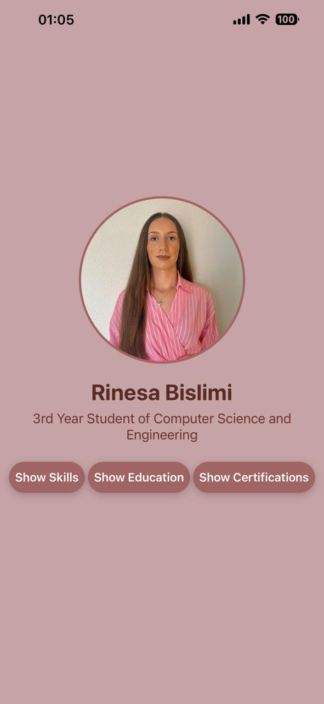
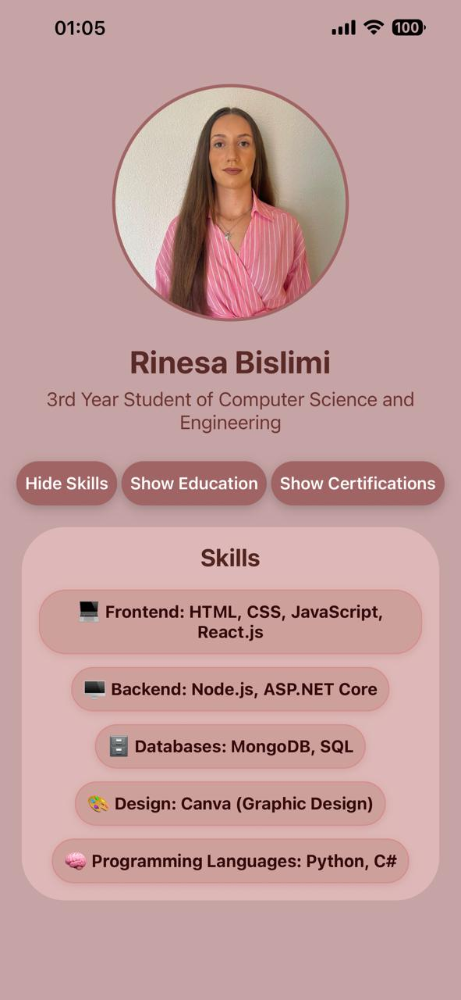
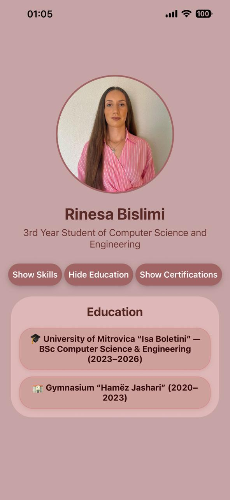

# 🌸 Personal Introduction App

## 📱 Project Overview
This is my **Week 1 React Native project** built with **Expo**.  
The app displays a short personal introduction including:

- **Name & Major**  
- **Profile Photo**  
- **List of Skills**  

A **toggle button** allows users to **show or hide skills dynamically**, demonstrating **React state management**.

---

## ✨ Features
- Displays **name** and **major**  
- Shows a **profile photo**  
- Lists **3–5 skills or interests**  
- **Toggle button** to show/hide skills dynamically  
- Custom styling with **colors, borders, shadows, and spacing**  
- Clean and organized code structure  

---

## 🧠 What You Learn
- Using core React Native components: `View`, `Text`, `Image`, `TouchableOpacity`  
- Styling with `StyleSheet`  
- Flexbox layouts and spacing  
- Managing visual hierarchy  
- Using **`useState`** to control UI behavior  
- Building a simple interactive UI  

---

## 🧩 Technologies Used
- **React Native**  
- **Expo**  
- **JavaScript**  

---

## 👩‍💻 About the Author
**Name:** Rinesa Bislimi  
**Major:** 3rd Year Student, Computer Science and Engineering  

**Skills & Interests:**  
- 💻 Frontend: HTML, CSS, JavaScript, React.js
- 🖥️ Backend: Node.js, ASP.NET Core
- 🗄️ Databases: MongoDB, SQL
- 🎨 Design: Canva (Graphic Design)
- 🧠 Programming Languages: Python, C#

---

## 🖼️ Preview
Screenshots showing the app in different states:

| Home Screen | Skills Section | Education Section | Certifications Section |
|-------------|----------------|------------------|----------------------|
|  |  |  |  |

---

## 🚀 How to Run the App
1. Install [Expo CLI](https://docs.expo.dev/get-started/installation/):  
   ```bash
   npm install -g expo-cli

2. Navigate to the project directory:
      ```bash
      cd <project-folder>

3. Install dependencies:
   Install required packages:
      ```bash
      npm install

4. For web compatibility, also install:
      ```bash
      npx expo install react-dom react-native-web


4. Start the Expo development server:
      ```bash
      npx expo start --tunnel

5. Open the app on your device using Expo Go or an emulator.

---

## 📝 Notes

- Sections toggle uses useState to show/hide dynamically.
- Custom styling includes borders, shadows, rounded corners, and spacing for a polished UI.
- Works best on mobile screens.
- For older React Native versions, the gap in skillsContainer may require additional margin adjustments on individual items.