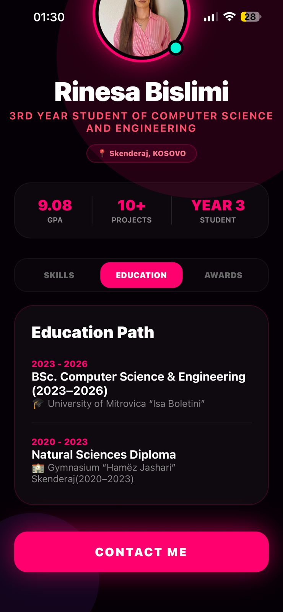
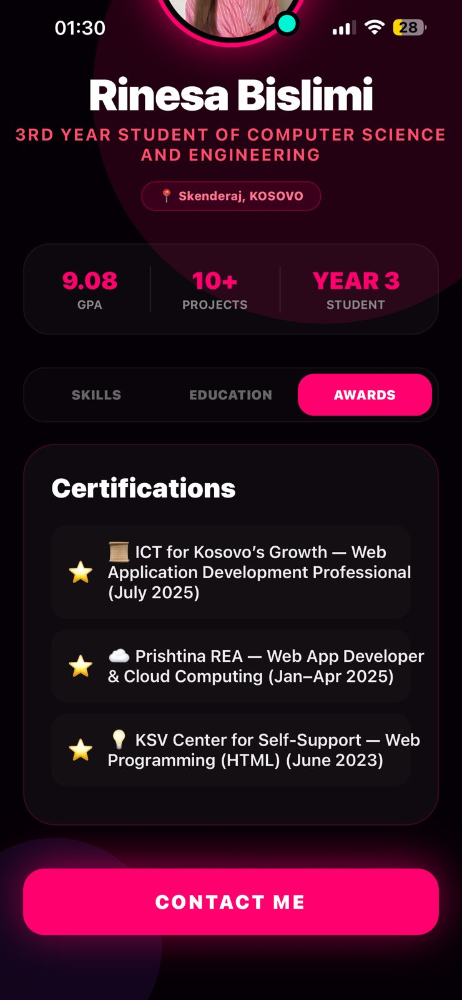

# 📱 Mobile App Development - Week 2: Personal App

## 📝 Project Information
- **Course:** Mobile App Development
- **Assignment:** Week 2 - Personal Introduction App
- **Student:** Rinesa Bislimi
- **University:** University of Mitrovica “Isa Boletini” (UMIB)

---

## 🌟 Project Overview
This mobile application is a professional personal portfolio built using **React Native** and **Expo**. The project demonstrates core concepts of mobile development, focusing on **State Management**, **Layout Design**, and **Interactive Components**.

The app features a **"Luxury Aurora Pink"** theme, providing a sleek, modern UI for displaying personal information, academic background, and technical skills.

---

## ✨ Core Features & Functionality
- **Dynamic UI (useState):** Implements a functional navigation system to toggle between different sections (Skills, Education, Certifications) without navigating to new screens.
- **Responsive Design:** Utilizes the `Dimensions` API to ensure consistent scaling across various screen sizes.
- **External Linking:** A functional "Contact Me" button that triggers the device's native mail app using the `Linking` API.
- **Advanced Styling:** Custom implementation of shadows, gradients (glow effects), and glassmorphism.

---

## 🛠️ Technical Stack
- **Framework:** React Native (Expo)
- **Language:** JavaScript (ES6+)
- **Layout:** Flexbox
- **UI Components:** View, ScrollView, Text, Image, TouchableOpacity

---

## 🧩 Sections Included
1. **Technical Stack:** Highlights expertise in React Native, Node.js, Python, and UI/UX tools (Justinmind, Canva).
2. **Education Path:** Detailed timeline of BSc studies at UMIB and Gymnasium history.
3. **Certifications:** Displays professional achievements including ICT for Kosovo’s Growth and Cloud Computing certificates.

---

## 📸 Application Screenshots

| Skills Section | Education Section | Certifications Section |
|:---:|:---:|:---:|
|  |  |  |

---

## 🚀 Installation & Setup

1. **Clone/Download** the project.
2. **Install Dependencies:**
   ```bash
   npm install

3. For web compatibility, also install:
      ```bash
      npx expo install react-dom react-native-web


4. Start the Expo development server:
      ```bash
      npx expo start --tunnel

5. Open the app on your device using Expo Go or an emulator.

---

## Developed by Rinesa Bislimi Computer Science & Engineering Student